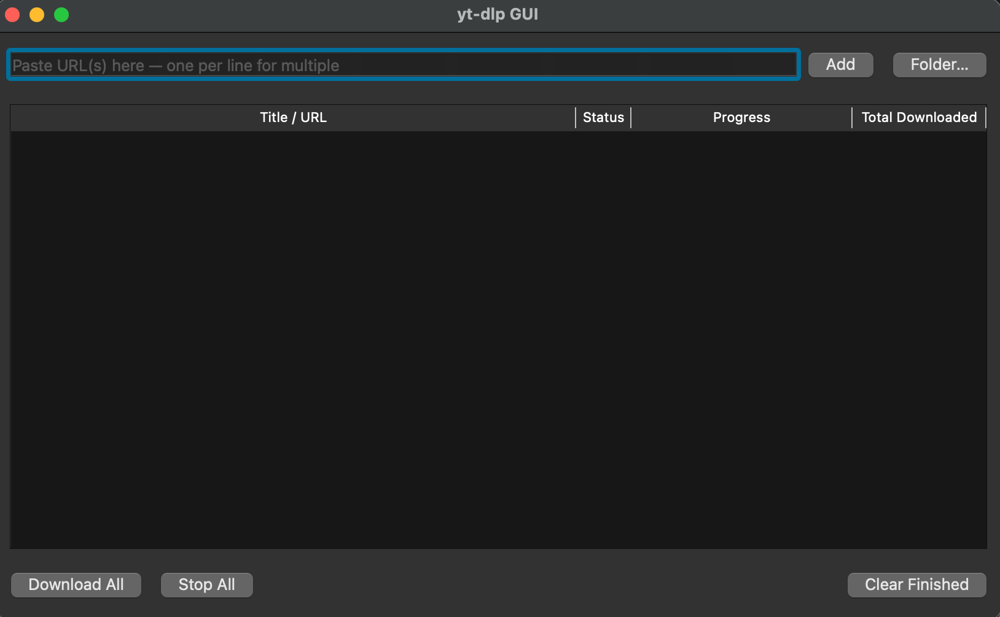

# yt-dlp GUI

A cross-platform desktop GUI for [yt-dlp](https://github.com/yt-dlp/yt-dlp), built with Python and PyQt6.



## Features

- **Batch downloads** — paste multiple URLs at once
- **Livestream recording** — record live streams with real-time progress (elapsed time, file size, speed)
- **Auto-retry** — streams that drop automatically retry up to 5 times
- **Thumbnail previews** — fetches video thumbnails and titles
- **Progress tracking** — progress bar, download speed, and total downloaded for each item
- **Output folder selection** — choose where files are saved
- **Context menu** — right-click to stop, retry, remove, or open file location

## Supported sites

Any site supported by [yt-dlp](https://github.com/yt-dlp/yt-dlp/blob/master/supportedsites.md) — YouTube, Twitch, Chaturbate, and 1000+ more.

## Installation

### Requirements

- Python 3.12+
- [uv](https://docs.astral.sh/uv/) (recommended) or pip

### Run from source

```bash
git clone https://github.com/sojiroh/yt-dlp-gui.git
cd yt-dlp-gui
uv run python main.py
```

### Build executable

```bash
uv pip install pyinstaller
uv run pyinstaller --onefile --windowed --name "yt-dlp-gui" main.py
```

The executable will be in `dist/`.

## Pre-built binaries

Check the [Releases](https://github.com/your-username/yt-dlp-gui/releases) page for pre-built executables for Linux, Windows, and macOS.

## License

[GPL-3.0](LICENSE)
